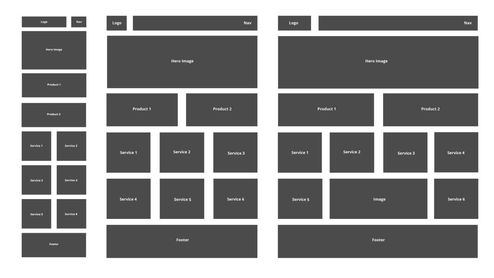

# Bandarra_Sydney_Project3
This is a GitHub Repository for MMED-1056 Web Development 1 - HW2 - Project 3 - Practice Scaffold

## Homework 2 - Project 3 - Practice Scaffold - Assignment Brief
Create a basic example of a media query based on the specs below. You must follow best practices and work mobile-first. Each student
must create a single web page using media queries to replicate the following on mobile, tablet and desktop.

## Installation
No installation required
## Usage
Practice fair use. Start with the README.md file, then view [index.html](index.html)

**How to Use the Index Page:**
1. View the Index
2. Grow and shrink the browser window to view the resposive grid in action.

### History
Version history is documented through GitHub best practices.
### Contributing
**Syd (Sydney) Bandarra** (they/them)

Student at Fanshawe College, Interactive Media Design, IDP, Fall 2023

Faculty of Creative Industries,

School of Digital and Performing Arts

137 Dundas Street, London, ON N6A 1E9

Student #: 1204224

s_bandarra@fanshaweonline.ca

www.fanshawec.ca 

### Land Acknowledgement 
London, Ontario is located on the traditional lands of the Anishinaabek, Haudenosaunee, Lūnaapéewak and Attawandaron peoples. This land continues to be home to diverse Indigenous peoples, whom we recognize as contemporary stewards of the land, vital contributors of our society, and deserving of sovereignty and reconciliation.
